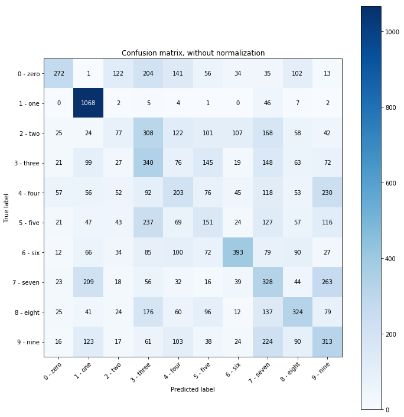
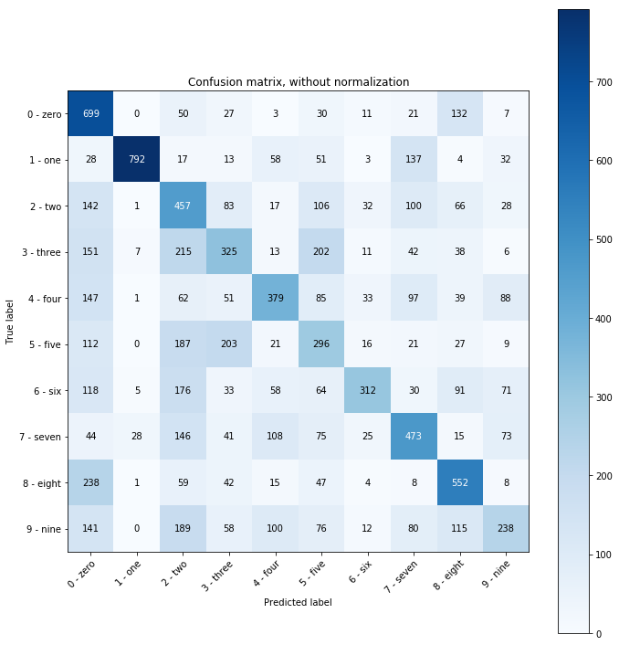

# MNIST by zip

For minimally more maths, see the blog post: https://www.blackhc.net/blog/2019/mnist-by-zip.html.

**tl;dr: We can use compression algorithms (like the well-known zip file compression) for machine learning purposes, specifically for classifying hand-written digits (MNIST).**

Learning means reducing information into knowledge. Through learning, we build concise models of the world that helps us navigate it. We reduce cognitive load by finding representations of information that require less "storage" for common events than for rare ones.

This insight connects (machine) learning, information theory, probability theory, *and compression*.

## A bit of machine learning, probability theory, and information theory

In machine learning, we want to solve problems like recognizing hand-written digits in the [MNIST dataset](http://yann.lecun.com/exdb/mnist/). Using probability theory, we can express this as finding the digit class that maximizes the probability of the test image being of that class given the information in our dataset.
 
Information theory is concerned with encoding information. An important result is that given a probability distribution that tells us how often or likely certain events occur, there is an optimal encoding: the more likely an event, the fewer bits will be used in this encoding.

In the case of hand-written digits, we can look at 10 different probability distributions: one for each class of digits. We then want to find the class that has minimal encoding length for a given image.

Using Bayes' theorem, we can see that both approaches are equivalent.

However, of course, we don't know the actual distribution or the optimal encoding. 

In machine learning, we would try to learn the probability distribution using deep neuronal networks and gradient descent, for example. 

Through information theory, we can also try to learn the optimal encoding using compression algorithms. Any statistical compression algorithm can be used for this. 

Statistical compression algorithms compress data by looking at the structure and statistics of the data itself. For example, by building look-up tables, or by creating Huffman trees like the well-known zip compression algorithm.

We could use zip compression to approximate optimal encoding! ^[Note: in particular, I am referring to the deflate compression algorithm here which is usually used by zip compressors.]

## Using zip compression for classification

We can train one compressor for each class of digits. We do this by separating our training data by digit class, so we have 10 files `digit_0.training`, `digit_1.training`, …, `digit_9.training`, and we compress each using zip compression, and memorize the compressed size.

When we want to classify a test image of a digit, given in a file `test.image`, we simply append it to each training file to obtain test files: `digit_0.test`, `digit_1.test`, …, `digit_9.test`, which we then compress as well. We compute the difference in compressed size to the training file, which tells us how well the test image was compressed with the training data for the different digits. The digit class with the highest compression (smalled compressed size difference) is our prediction. 

Because zip compression makes use of data statistics, it is more likely that the test image will be compressed better when it is appended to the training data of digit that it represents. 

## Performance

With default compression parameters, and a byte stream in MNIST, we can obtain 27% accuracy on the full test set. By trying a couple of different parameters (compression level 9 and window bits -10, whatever that means…), we can obtain 35% accuracy using zip on MNIST:

```
Classification report for classifier ZipCompressionClassifier():
              precision    recall  f1-score   support

           0       0.58      0.28      0.37       980
           1       0.62      0.94      0.74      1135
           2       0.19      0.07      0.11      1032
           3       0.22      0.34      0.26      1010
           4       0.22      0.21      0.21       982
           5       0.20      0.17      0.18       892
           6       0.56      0.41      0.47       958
           7       0.23      0.32      0.27      1028
           8       0.36      0.33      0.35       974
           9       0.27      0.31      0.29      1009

    accuracy                           0.35     10000
   macro avg       0.35      0.34      0.33     10000
weighted avg       0.35      0.35      0.33     10000
```


### Binarized MNIST

If we binarize the dataset by thresholding on 128 (still using one byte per pixel though), we can achieve 45% accuracy:

```
Classification report for classifier ZipCompressionClassifier():
              precision    recall  f1-score   support

           0       0.38      0.71      0.50       980
           1       0.95      0.70      0.80      1135
           2       0.29      0.44      0.35      1032
           3       0.37      0.32      0.34      1010
           4       0.49      0.39      0.43       982
           5       0.29      0.33      0.31       892
           6       0.68      0.33      0.44       958
           7       0.47      0.46      0.46      1028
           8       0.51      0.57      0.54       974
           9       0.42      0.24      0.30      1009

    accuracy                           0.45     10000
   macro avg       0.49      0.45      0.45     10000
weighted avg       0.49      0.45      0.45     10000
```


### Conclusion

Using zip compression as a classifier is significantly better than random (10% expected accuracy). As another comparison, we have also implemented a classifier that just counts the number of pixels in images for different digits and picks the nearest class for a test image: it achieves 20% accuracy. Overall, zip compression can capture some of MNIST's structure to make somewhat informed classification decisions.

We are uncertain whether this is an appraisal of zip compression or an indictment of the MNIST dataset.  

## Acknowledgements

Thanks to Christopher Mattern (from DeepMind) for mentioning this to me (as a joke?) a couple of years ago at Friday Drinks and to [Owen Campbell Moore](https://twitter.com/owencm) for turning a random afternoon conversation into a tiny hack project later. I have always remembered it as a fun fact and was surprised when no one else knew about it either. So, here we go. :)

## Code

For simplicity, I have implemented a `ZipCompressionClassifier` that is compatible with [https://scikit-learn.org/](https://scikit-learn.org/).

For fun, I have also added a BASH version using `gzip`. To reproduce the results on the first 10 entries from MNIST's test data, run:
```bash
for test_file in data/*.image; do ./classify.sh $test_file; done
```

